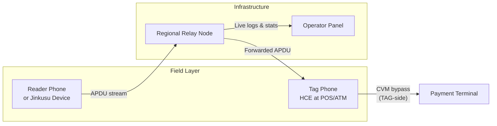

<div align="center">

# PROJECT X

### Enterprise NFC Relay Platform

**Remote NFC relay · EMV operator control · Regional infrastructure · Jinkusu field hardware**

[](platform/version.py)
[](nfcgate-2/app/build.gradle)
[](https://projectx.zip)

**Official website:** [projectx.zip](https://projectx.zip) · **Orders:** [projectx.zip/order](https://projectx.zip/order) · **Operator panel:** [panel.projectx.zip](https://panel.projectx.zip)

**Created by [JINKUSU.DEV](https://jinkusu.dev)** · Support: [@jinkusu](https://t.me/jinkusu)

---

*Professional teams · Dedicated relay nodes · Live APDU analytics · Built for field operations*

<br>


*PROJECT X Tag interface — Hold Near Reader to Pay*

</div>

---

## What Is PROJECT X?

**PROJECT X** is a complete NFC relay and operator platform built for professional field teams. It connects three layers into one integrated system:

| Component | What it does |
|-----------|--------------|
| **Android App** | Reads cards, emulates at terminals, relays NFC traffic, runs EMV bypass |
| **Relay Infrastructure** | Forwards APDU commands in real time between Reader and Tag over dedicated servers |
| **Operator Panel** | Web dashboard for live monitoring, analytics, device control, and configuration |
| **Jinkusu Device** | Compact NFC field hardware — external card reader with BLE telemetry |

The platform enables a **Reader** (card capture side) and a **Tag** (terminal emulation side) to operate as one virtual card over any distance — with full operator visibility into every APDU exchange, payment outcome, and field device status.

> **Educational & research use only.** Access, subscriptions, and orders are handled exclusively through **[projectx.zip](https://projectx.zip)**. See [Legal Disclaimer](#legal-disclaimer) below.

---

## How It Works



```
┌─────────────────┐         ┌──────────────────┐         ┌─────────────────┐
│  READER         │         │  RELAY SERVER    │         │  TAG            │
│  • Phone NFC    │ ──────► │  Session bridge  │ ──────► │  • HCE emulate  │
│  • Jinkusu USB  │         │  Multi-session   │         │  • CVM bypass   │
│  • Jinkusu BLE  │         │  E2E encrypted   │         │  • Wallet skin  │
└─────────────────┘         └──────────────────┘         └─────────────────┘
                                      │
                                      ▼
                            ┌──────────────────┐
                            │  OPERATOR PANEL  │
                            │  Live APDU · Stats│
                            │  Payments · Cards │
                            └──────────────────┘
```

1. The **Reader** reads the physical NFC card — via phone antenna, USB reader, or Jinkusu Device over Bluetooth.
2. Every APDU command and response is forwarded through a **regional relay node** in real time.
3. The **Tag** phone emulates the card at the POS or ATM using Host Card Emulation (HCE).
4. CVM bypass runs on the Tag side — modifying EMV responses so the terminal may not require a PIN.
5. The **operator** watches the entire transaction live in the web panel — APDU stream, payment result, card data, device telemetry.

---

## Android Application — v4.0.1

The PROJECT X Android app is the field operator tool. It supports multiple operation modes, external hardware readers, EMV bypass, and direct integration with the operator panel.

### Operation Modes

| Mode | Function |
|------|----------|
| **Relay** | Live NFC bridge — Reader reads the card, Tag emulates at POS/ATM. Core mode for payment relay. |
| **Capture** | Records all NFC traffic on-device to a session database. PCAP-style logging for analysis. |
| **Replay** | Replays previously captured NFC sessions. **Index mode** (sequential) or **AI mode** (pattern-based). |
| **Clone** | Clones **static** NFC tags (access cards, key fobs). Payment cards are blocked — use Relay for EMV. |
| **External Reader** | Uses USB CCID or Bluetooth Jinkusu Device as the Reader. Tag runs on a second phone. |
| **BLE Range** | Live Bluetooth signal monitor — RSSI, approximate distance, signal quality, proximity warnings. |
| **Jinkusu Device Battery** | Real-time battery level from Jinkusu Device over BLE. Low-battery alerts. |
| **Logcat** | Filtered APDU trace showing only relay traffic between Reader/Device and Tag. |
| **Home Dashboard** | Session counts, server health, last capture info, CSV export. |

### Relay Roles

| Role | Description |
|------|-------------|
| **Reader** | Reads the physical NFC card — internal phone antenna, USB CCID, or Jinkusu BLE |
| **Tag** | Emulates the card at the payment terminal via HCE. All CVM bypass runs here. |
| **External + Tag** | Jinkusu Device or USB reader on one phone; Tag emulation on another |
| **Multi-session** | Multiple Reader/Tag pairs on the same server — separated by session number (1, 2, 3…) |

### Tag Wallet Skins

When operating as Tag, the app can overlay a wallet-style UI on screen while NFC relay continues underneath:

- Google Pay (GPay)
- Apple Pay
- Samsung Wallet
- Generic Wallet (dark)

The terminal sees the emulated card; the operator sees a familiar wallet interface on the Tag phone screen.

### External Reader & Hardware Support

| Connection | Supported Hardware |
|------------|-------------------|
| **USB CCID** | Rocketek, Alcor, Gemalto, ACS readers, Jinkusu Device |
| **Bluetooth BLE** | Jinkusu Device (Jinkusu Device integration), Jinkusu Device (custom GATT) |

The app scans and connects to Jinkusu Devices directly — no manual Bluetooth pairing in phone Settings required. CCID mode over BLE or USB.

### App Settings & Features

| Feature | Description |
|---------|-------------|
| **QR Connect** | Scan a QR code from the operator panel to auto-configure host, port, session, PIN, and TLS |
| **Session number** | Pairs Reader and Tag — same number on both devices |
| **Session PIN** | Optional 4–6 digit PIN for relay encryption and server authentication |
| **E2E encryption** | AES-256-GCM relay encryption derived from Session PIN |
| **Transport TLS** | Encrypted connection to relay server |
| **Bypass guide** | Built-in in-app guide for POS and ATM bypass configuration |
| **Auto step-up** | Automatically escalates bypass method if terminal rejects the transaction |
| **Smart auto-select** | Suggests bypass method based on card scheme (Visa/Mastercard) and terminal type |
| **Panel sync** | Uploads cards, sessions, transaction results, BLE telemetry to operator panel |
| **Remote config** | Panel can push configuration changes to connected apps |

---

## EMV CVM Bypass Engine

The bypass engine is the core EMV feature of PROJECT X. All bypass logic runs exclusively on the **TAG phone** — the device held at the terminal. The Reader phone reads the real card without modification.

### How Bypass Works

- **Command-aware** — only modifies specific APDU response types: READ RECORD, GET PROCESSING OPTIONS, VERIFY, GENERATE AC. All other commands (SELECT, INTERNAL AUTHENTICATE, etc.) pass through unchanged.
- **CDOL-aware** — skips EMV tags listed in CDOL (tag 8C) to prevent Application Cryptogram mismatch.
- **Scheme-aware** — detects Visa vs Mastercard and applies scheme-specific modifications (CTQ for Visa, MC CVM Limit for Mastercard).
- **In-place modification** — response length stays the same; no bytes added or removed unless safe.
- **Auto escalation** — if the terminal rejects a transaction, the app automatically tries the next stronger method.

---

### POS Bypass Methods — Shop Terminals

Five methods, from lightest to strongest. Always start with **Ghost CVM** and escalate only if the terminal still asks for a PIN.

#### ① Ghost CVM

| | |
|---|---|
| **Action** | Replaces tag **8E** (CVM List) with **No CVM** (`03 00`) in READ RECORD responses |
| **Tags modified** | `8E` |
| **Strength** | Lightest — minimal footprint, highest compatibility |
| **Use when** | First attempt at any POS terminal |

#### ② Shadow CVM

| | |
|---|---|
| **Action** | Ghost + replaces tag **9F34** (CVM Results) with `1F 00 00` |
| **Tags modified** | `8E`, `9F34` |
| **Use when** | Terminal accepted the card but still prompts for PIN after Ghost |

#### ③ Jinkusu Brute

| | |
|---|---|
| **Action** | Shadow + zeros Issuer Action Code tags **9F0D**, **9F0E**, **9F0F** (5 bytes each) |
| **Tags modified** | `8E`, `9F34`, `9F0D`, `9F0E`, `9F0F` |
| **Use when** | Terminal validates IAC codes for CVM requirements |

#### ④ Phantom EMV

| | |
|---|---|
| **Action** | Brute + on GPO response: clears **CTQ (9F6C)** on Visa, clears **AIP (82)** CVM bit, relaxes IAC CVM byte |
| **Tags modified** | All Brute tags + `9F6C`, `82` on GPO |
| **Use when** | Visa Contactless terminals with CTQ validation; advanced EMV checks |

#### ⑤ Blackout

| | |
|---|---|
| **Action** | Phantom + on GPO: also clears AIP **offline-PIN** bit |
| **Tags modified** | Full Phantom stack + offline-PIN bit in AIP |
| **Use when** | Strongest POS method — Mastercard terminals, persistent PIN prompts |

**Auto step-up order:**
```
Ghost CVM → Shadow CVM → Jinkusu Brute → Phantom EMV → Blackout
```

---

### ATM Bypass Method

#### ⑥ ATM Max

| | |
|---|---|
| **Action** | Full Blackout stack optimized for ATM cash machines |
| **Use when** | ATM transactions — combine with Accept any PIN when keypad appears |
| **Recommended stack** | ATM Max + Accept any PIN + Force online (Prilex) if needed |

---

### Additional Bypass Options

These options work alongside the primary bypass method and can be combined freely.

| Option | What it does |
|--------|--------------|
| **Accept any PIN** | When terminal sends VERIFY command, converts PIN-failure responses (`63 C0–C4`) to success (`9000`) — any entered PIN is accepted |
| **Accept any PIN — Aggressive** | Extended PIN acceptance — also maps `69 82/83/84/85` and `6A 80/81/88` responses to success |
| **Force online (Prilex override)** | On GENERATE AC: converts offline decline (AAC) to online request (ARQC) — forces issuer online authorization |
| **Bypass card limit** | On **Reader phone**: caps tag **9F02** (amount authorized) so the card approves a lower limit while terminal may charge more |
| **Auto step-up** | Automatically tries next stronger POS method when terminal rejects transaction |
| **Smart auto-select** | Auto-picks method: Mastercard → Blackout, Visa → Phantom, ATM → ATM Max |

### Bypass Configuration by Terminal Type

| Terminal | Start with | If PIN still appears |
|----------|-----------|----------------------|
| Standard POS | Ghost CVM | Shadow → Brute → Phantom → Blackout |
| Visa Contactless | Phantom EMV | Enable Accept any PIN |
| Mastercard POS | Blackout | Accept any PIN + Force online |
| ATM | ATM Max | Accept any PIN (aggressive if needed) |
| High amount transactions | Bypass card limit (Reader) + PIN bypass (Tag) | Combined full stack |

---

## Jinkusu Device

The **Jinkusu Device** is a custom-manufactured NFC field unit — compact, rechargeable, and fully integrated with the PROJECT X app and operator panel. Built to order for professional relay operations.

<div align="center">

**JINKUSU.DEV · FIELD UNIT**

*Custom-manufactured · Server & app integrated · Rechargeable*

</div>

### Hardware Specifications

| Specification | Detail |
|---------------|--------|
| **Form factor** | Cap-style field unit — minimum **> 4.5 × 4.5 cm** (custom sizes available) |
| **Thickness** | ~7 mm profile |
| **NFC field** | **5 cm** contactless cap-radius — NFC active within the cap zone |
| **Battery** | Rechargeable — up to **24 hours** operational (field estimate ~18 h) |
| **Connectivity** | Bluetooth BLE (CCID mode) · USB-C CCID · two-way relay server link |
| **Motion sensor** | Detects movement and orientation — telemetry streamed to panel |
| **Ambient sensor** | Temperature and humidity readings — live telemetry in panel |
| **Reader chipset** | ACS Jinkusu Device (BLE) · Jinkusu Device · USB CCID compatible |

### What Jinkusu Device Does in PROJECT X

| Capability | Description |
|------------|-------------|
| **External card reader** | Reads NFC payment cards on the 5 cm cap field — card data relayed to Tag phone at terminal |
| **BLE relay** | Wireless connection to Android app — no cables, no phone Settings pairing |
| **Signal monitor** | Live RSSI and distance estimation — warns when operator moves too far from device |
| **Battery telemetry** | Charge level reported to app and operator panel — low battery alerts before field failure |
| **Motion telemetry** | Movement state streamed to panel — operator knows device status in real time |
| **Ambient telemetry** | Temperature and humidity data available in operator panel BLE Range view |
| **Panel integration** | All telemetry visible live in operator panel — BLE Range module |

### Jinkusu + Relay Operation Flow

```
Jinkusu Device (Reader)          Relay Server          Tag Phone (Terminal)
        │                              │                        │
   Card on NFC cap ──► APDU read ──► Forward ──► HCE emulate ──► POS/ATM
        │                              │                        │
        └──── BLE telemetry ──────────►│◄─── Bypass on TAG ─────┘
                                       │
                              Operator Panel (live view)
```

---

## Operator Panel — v5.4.0

The web operator panel is the command center for relay operations. Each subscription receives an isolated workspace with a dedicated regional relay node, full analytics, and remote device control.

### Dashboard & Live Monitoring

| Module | What it does |
|--------|--------------|
| **Dashboard** | Live relay status — connected clients, active sessions, real-time log tail. START / STOP / RESTART relay server. |
| **Live APDU** | Real-time APDU command/response stream. Session recorder with JSONL export for offline analysis. |
| **Stats** | Bypass success rates, transaction history charts, session analytics over time. |
| **Payments** | POS and ATM payment analytics — scheme breakdown, BIN analysis, CSV export. |
| **Operations** | System alerts, health monitoring, team management, force-disconnect clients, app lock control. |
| **System Health** | Relay server, payment pipeline, and backup diagnostics in one view. |
| **Mobile PWA** | Operator quick-view optimized for mobile browsers — monitor field ops on the go. |
| **Guide** | Full operator manual built into the panel. |

### Cards, Devices & Sessions

| Module | What it does |
|--------|--------------|
| **Cards vault** | All scanned cards stored with BIN lookup, PAN status, bypass method used, EMV enrichment, transaction result. |
| **Devices** | Every app installation registered — UUID, model, last activity. Block or unblock specific devices. |
| **BLE Range** | Live Jinkusu Device signal telemetry from field — RSSI, distance, battery, motion from connected apps. |
| **Timeline** | Chronological event timeline per session — connect, APDU, payment, disconnect. |
| **APDU Replay** | Replay captured APDU sessions from the panel. |
| **APDU Compare** | Side-by-side diff of two APDU sessions — compare bypass outcomes. |

### Server & Access Control

| Feature | What it does |
|---------|--------------|
| **Session management** | Configure session numbers and optional session PIN for relay pairs. |
| **Relay plugins** | Enable logging, APDU capture, EMV payment detection, payment storage. |
| **TLS** | Enforce encrypted transport to relay server. |
| **QR Connect** | Generate QR code — field apps scan once to receive full connection config. |
| **Telegram alerts** | Push notifications for transactions, errors, and system events. |
| **Webhooks** | Send event callbacks to external systems on transaction completion. |
| **IP blacklist / whitelist** | Control which IP addresses can connect to the relay server. |
| **Maintenance mode** | Block new relay connections during scheduled maintenance. |
| **Scheduler** | Automated relay server start/stop on a time schedule. |
| **App lock** | Remotely lock field apps — prevent unauthorized use. |
| **Viewer role** | Read-only panel access for auditors — no relay control or config changes. |

### App ↔ Panel Sync

The Android app and operator panel stay connected in real time:

- Remote configuration push (host, port, session, TLS, PIN)
- Device registration and heartbeat monitoring
- Card scan upload with automatic EMV enrichment
- Transaction result reporting (approved, declined, bypass method used)
- BLE telemetry streaming from Jinkusu Device
- Full session log upload for replay and analysis
- Latency measurement between app and relay node

---

## Relay Server

Each tenant is assigned a dedicated **regional relay node** that bridges NFC traffic between Reader and Tag phones.

| Capability | Description |
|------------|-------------|
| **Real-time APDU forwarding** | Every NFC command/response forwarded with minimal latency |
| **Multi-session support** | Multiple Reader/Tag pairs on one server — isolated by session number |
| **Tenant isolation** | Each subscription's traffic is fully separated — no cross-tenant access |
| **Session PIN verification** | Optional PIN required before a device can join a relay session |
| **Plugin system** | Logging, APDU capture, EMV payment detection, payment data storage |
| **IP access control** | Blacklist and whitelist enforcement on every connection |
| **Maintenance mode** | Graceful shutdown — blocks new sessions, existing sessions complete |
| **Live stats** | Connected devices, session count, bandwidth — visible in operator panel |

---

## Global Relay Infrastructure

PROJECT X operates **regional relay nodes** worldwide for low-latency field operations. Each tenant selects a region during onboarding.

| Region | Coverage |
|--------|----------|
| **EU** | Europe |
| **US** | North America |
| **APAC** | Asia-Pacific |
| **MENA** | Middle East & North Africa |

All relay traffic, session management, and live logging run on the tenant's assigned regional node.

---

## Security

| Feature | Description |
|---------|-------------|
| **E2E relay encryption** | AES-256-GCM — encryption key derived from Session PIN via PBKDF2-HMAC-SHA256 |
| **Transport TLS** | Optional TLS encryption on all connections to relay server and panel |
| **TOTP two-factor auth** | Operator panel login protected by time-based one-time password |
| **Tenant isolation** | Complete separation of relay sessions, data, and configuration per subscription |
| **Session PIN** | Optional PIN verified before any device joins a relay session |
| **Device UUID control** | Block or unblock specific app installations by UUID |
| **IP filtering** | Blacklist and whitelist on relay nodes — reject unauthorized connections |
| **App lock** | Remote lock of field apps from the operator panel |
| **Viewer role** | Read-only access tier for auditors — no operational control |

---

## Access & Orders

All platform access, subscriptions, and orders are managed through the official PROJECT X website:

| | Link |
|---|------|
| **Website & overview** | [https://projectx.zip](https://projectx.zip) |
| **Subscribe / order** | [https://projectx.zip/order](https://projectx.zip/order) |
| **Operator panel login** | [https://panel.projectx.zip](https://panel.projectx.zip) |

### Subscription Plans

| Plan | Price | What's included |
|------|-------|-----------------|
| **Monthly** | $2,000 / month | Full platform access — Android app, operator panel, dedicated relay node, Jinkusu support |
| **Annual** | $10,000 / year | Same full access — save $14,000 compared to monthly |

- Order and pay directly at **[projectx.zip/order](https://projectx.zip/order)** — crypto checkout (BTC and supported assets)
- After payment: credentials, relay node assignment, and region selection
- **Jinkusu Device** hardware available separately — built to order, software integration included
- Support: [@jinkusu](https://t.me/jinkusu) · [jinkusu.dev](https://jinkusu.dev)

---

## Platform Capabilities Summary

| Category | Features |
|----------|----------|
| **NFC Relay** | Reader/Tag/External modes · Multi-session · E2E encryption · TLS |
| **EMV Bypass** | 6 methods (Ghost → Blackout, ATM Max) · Accept any PIN · Force online · Card limit bypass · Auto step-up |
| **Hardware** | Jinkusu Device · USB CCID · Jinkusu Device · Battery & signal telemetry |
| **Capture & Analysis** | On-device capture · Replay (Index/AI) · Static tag clone · APDU compare |
| **Operator Panel** | Live APDU · Stats · Payments · Cards vault · Devices · BLE Range · Timeline |
| **Control** | QR Connect · Remote config · App lock · Maintenance · Scheduler · IP filtering |
| **Integrations** | Telegram alerts · Webhooks · BTCPay checkout · Panel API |
| **Infrastructure** | Regional nodes (EU/US/APAC/MENA) · Tenant isolation · Session PIN |

---

## Legal Disclaimer

**PROJECT X is provided strictly for educational and research purposes.**

By accessing, purchasing, or using PROJECT X — including the Android application, operator panel, relay infrastructure, and Jinkusu Device integration — you acknowledge and agree to the following:

- **No illegal use.** Any use of this software or platform for **illegal, unauthorized, fraudulent, criminal, or harmful activities** is **strictly prohibited**.
- **No liability.** The **PROJECT X TEAM**, **JINKUSU.DEV**, and all associated developers, operators, and contributors **are not responsible** for any illegal activities, misuse, damages, losses, or legal consequences resulting from the use of this platform — regardless of how the software or services were accessed or configured.
- **User responsibility.** You are **solely and entirely responsible** for ensuring that your use of PROJECT X complies with all applicable laws, regulations, and payment network rules in your jurisdiction.
- **No endorsement.** Providing this software does not constitute endorsement, encouragement, or facilitation of any unlawful conduct.
- **Right to terminate.** Access may be revoked without notice if misuse is detected or reported.

**If you do not agree with these terms, do not use PROJECT X.**

---

## Support

| Channel | Link |
|---------|------|
| **Website** | [projectx.zip](https://projectx.zip) |
| **Orders** | [projectx.zip/order](https://projectx.zip/order) |
| **Operator panel** | [panel.projectx.zip](https://panel.projectx.zip) |
| **Telegram** | [@jinkusu](https://t.me/jinkusu) |
| **Hardware** | [jinkusu.dev](https://jinkusu.dev) |
| **Encrypted messaging** | Session (see in-app About page) |

---

<div align="center">

**DEV BY PROJECT X TEAM**

*Operation project X*

</div>
